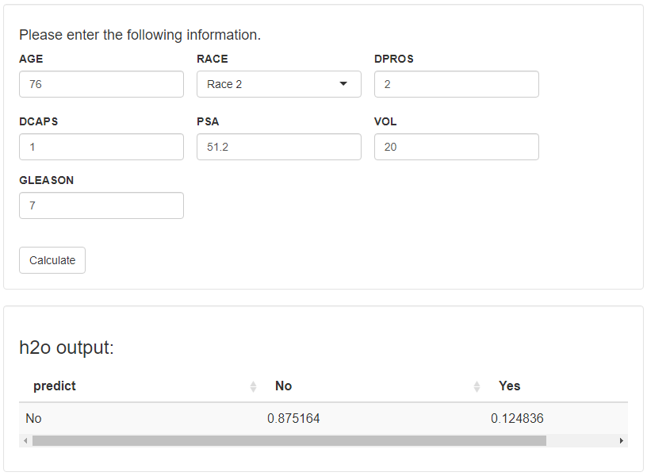

<!-- README.md is generated from README.Rmd. Please edit that file -->

```{r, include = FALSE}
knitr::opts_chunk$set(
  collapse = TRUE,
  comment = "#>",
  fig.path = "man/figures/README-",
  out.width = "100%"
)
```

# splash: Splashing a User Interface onto h2o MOJO Files

<!-- badges: start -->
<!-- badges: end -->

When supplied with the path to an `h2o` mojo (`.zip`) file, `splash` builds an interactive document (`.Rmd` file), provides an `h2o-genmodel.jar` file, and launches the interactive document using `rmarkdown::render()`.

## Installation

You can install the development version of `splash` from GitHub with:

``` r
remotes::install_github('ML4LHS/splash')
```

## Here is how it works

```{r eval=FALSE}
library(splash)

temp_dir = file.path(tempdir(), 'splash_test')

dir.create(temp_dir)

file.copy(from = system.file('extdata/prostate_model.zip', package = 'splash'),
          to = file.path(temp_dir, 'prostate_model.zip'))

splash(file.path(temp_dir, 'prostate_model.zip'), overwrite = TRUE)
```


